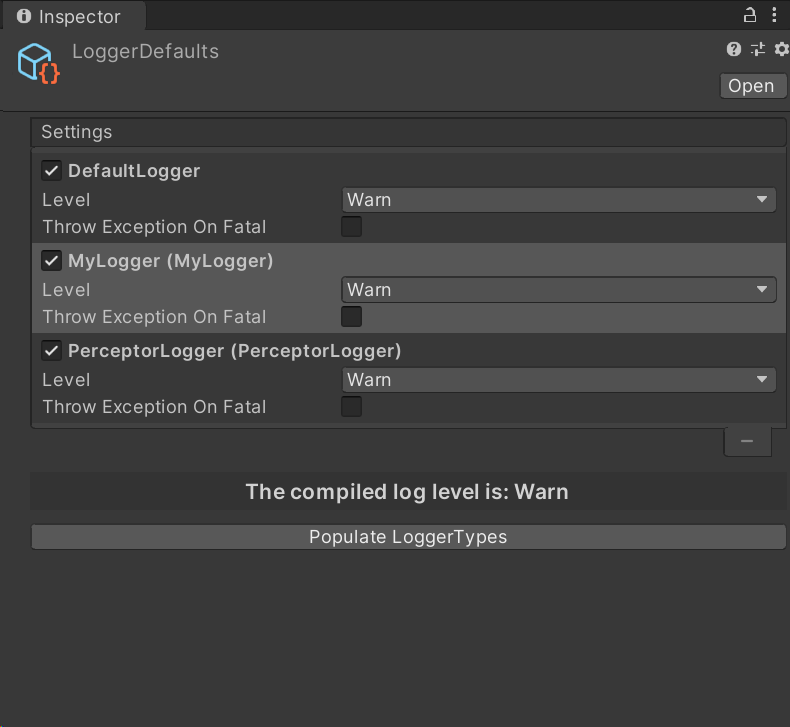

<h1 align="center">Welcome to Perceptor 👋</h1>
<p>
  <a href="https://www.apache.org/licenses/LICENSE-2.0.txt" target="_blank">
    
  </a>
  <a href="https://github.com/Rhinox-Training/rhinox-perceptor/pulls"></a>
  <a href="https://openupm.com/packages/com.rhinox.open.perceptor/" target="_blank">
    
  </a>
</p>

> Unity Logging Framework: flexibly log to different channels & control the verbosity

## Install

This package is being hosted on [openupm](https://openupm.com/packages/com.rhinox.open.perceptor/).
If you have their CLI installed you can use the following command.

```sh
openupm install com.rhinox.open.perceptor
```

If not, you can manually edit the manifest.json (as described on the openupm page) or install it as a git package using the following url:
`https://github.com/Rhinox-Training/rhinox-perceptor?path=/Assets/Perceptor`

# Content

This logging framework is used to flexibly log to different channels (called Loggers) and to allow the developer to tweak the verbosity of each different based on what part of their game/framework they want to debug.

### Channels

To setup a channel is quite simple, just inherit from CustomLogger. A simple example, which simply logs to unity's Debug.Log (the default behaviour).

```cs
public class PerceptorLogger : CustomLogger { }
```

### Logging

Once you've setup one or more channels you can use them as follows:

```cs
PLog.Trace<PerceptorLogger>("Hello World!");
PLog.TraceDetailed<PerceptorLogger>("Hello World!");
PLog.Debug<PerceptorLogger>("Hello World!");
PLog.Info<PerceptorLogger>("Hello World!");
PLog.Warn<PerceptorLogger>("Hello World!");
PLog.Error<PerceptorLogger>("Hello World!");
PLog.Fatal<PerceptorLogger>("Hello World!");
```
- Can provide gameobject context which will ping when clicked in the console
- Log an exception as fatal
- TraceDetailed will add the following info: [\<FileName>::\<methodname>] of where the log was called.

### Control

Under Resources/ you'll find a scriptableobject 'LoggerDefaults'. Here you can configure what level of logs you wish to happen. You can disable entire channels or put choose to put 1 channel on trace and the others on warn, etc.
If you've created a logger but do not see it in the list, press the `Populate LoggerTypes` button.




As you can also see, it mentions the 'compiled log level'. Every log lower than the lowest shared level, will be stripped from being executed. This to save performance and skip executing unnecessary string formats.

### LogTargets

If you want a bit more customization, you can append logtargets to your logger, in the following example it will also logs to a file, and add a timestamp before the message.

```cs
public class PerceptorLogger : CustomLogger
{
    public const string FILE_NAME = "perceptor.log";

    protected override ILogTarget[] GetTargets()
    {
        return new ILogTarget[] {
            new UnityLogTarget(),
            CreateFileTarget()
        };
    }

    public static ILogTarget CreateFileTarget()
    {
        var logTarget = FileLogTarget.CreateByPath(FILE_NAME);
        // Prepends the message with the time of the log
        // i.e. [17:20:05] TRACE > Hello World
        var logBuilder = new LogTimeBuilder("[HH:mm:ss]") 
            .Append(new LogLevelBuilder(), " ")
            .Append(PLog.DefaultBuilder, "> "); 

        logTarget.SetCustomMessageBuilder(logBuilder);
        return logTarget;
    }
}
```

Logtargets can also be configured from a different location as such:

```cs
[RuntimeInitializeOnLoadMethod]
public static void InitializePLog()
{
    Rhinox.Perceptor.PLog.CreateIfNotExists();
    var sharedFileTarget = FileLogTarget.CreateByName("game");
    Rhinox.Perceptor.PLog.AppendLogTargetToDefault(sharedFileTarget);
    Rhinox.Perceptor.PLog.AppendLogTarget<PerceptorLogger>(sharedFileTarget);
}
```

## Show your support

- Feel free to make an issue if you find any problems
- Feel free to make a pull request if you wish to contribute
- Give a ⭐️ if this project helped you!

## 📝 License

This project is [Apache--2.0](https://www.apache.org/licenses/LICENSE-2.0.txt) licensed.